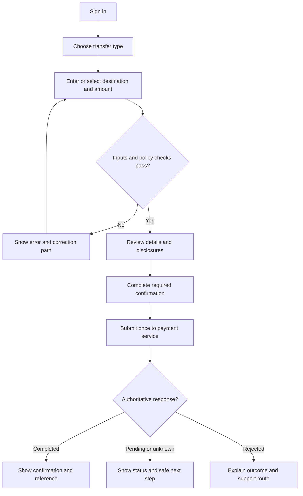
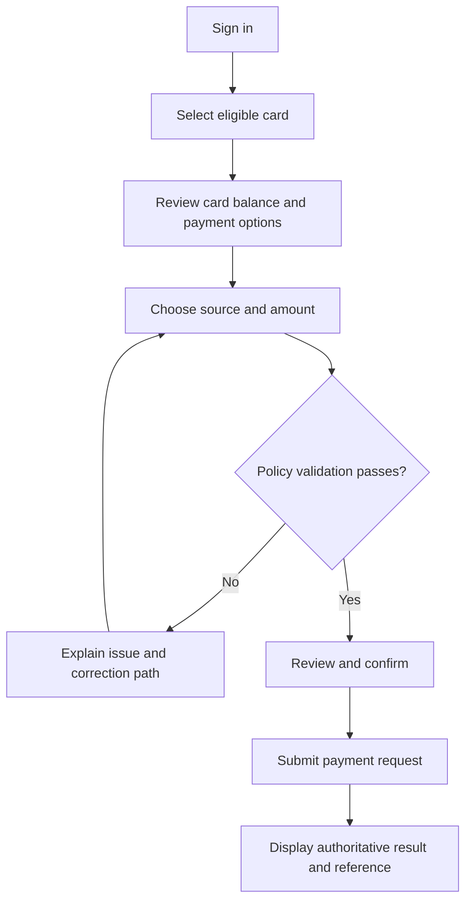

# Process Maps — Current-State Hypothesis and Proposed To-Be

**Important:** The source deck does not describe how customers currently perform these tasks. The “As-Is” below is a hypothesis for discovery, not a factual bank process map. Validate with branch, contact-centre, card, and payment operations.

## As-Is hypothesis: customer requests account/card servicing

1. Customer needs account, statement, transfer, utility-payment, or card information.
2. Customer may use an existing channel or contact staff (channels/processes are not specified in source).
3. Staff or system checks identity, product eligibility, and source-system information (hypothesized).
4. Staff/customer attempts request; exception and confirmation handling are unknown.
5. Customer receives information or needs follow-up; timing/outcome evidence is absent.

Discovery must replace this hypothesis with validated actors, systems, decisions, hand-offs, wait states, controls, exceptions, and performance data.

## To-Be draft: bank transfer

## To-Be draft: credit-card payment

## Process controls/questions

- Where does the authoritative transaction state come from?
- How are duplicate submissions, timeouts, pending requests, reversals, reconciliation, and support escalations handled?
- Which steps require additional verification or dual control?
- Which customer-facing messages are permitted for security and privacy?
- How do channel and payment-rail operating windows affect the process?
