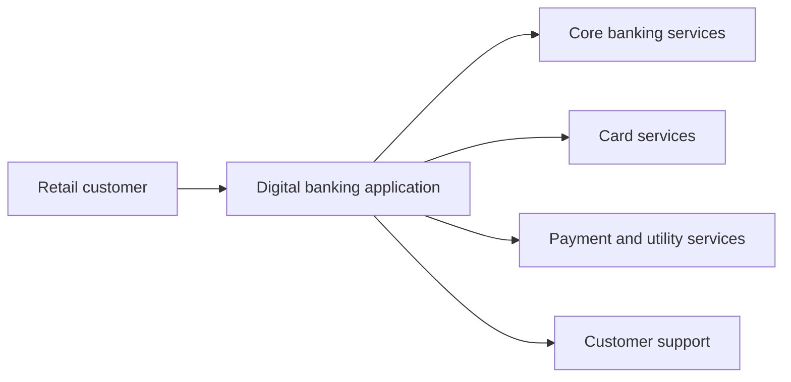
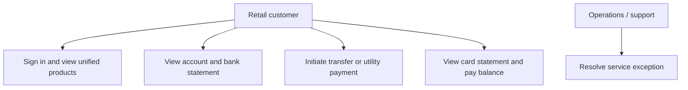
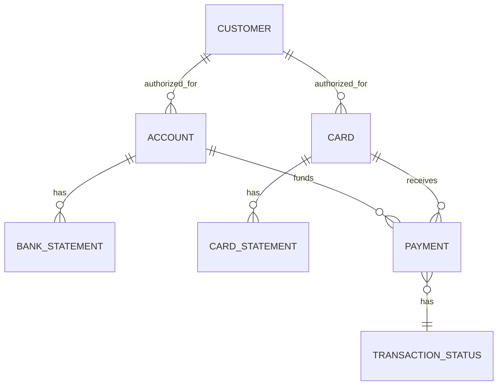
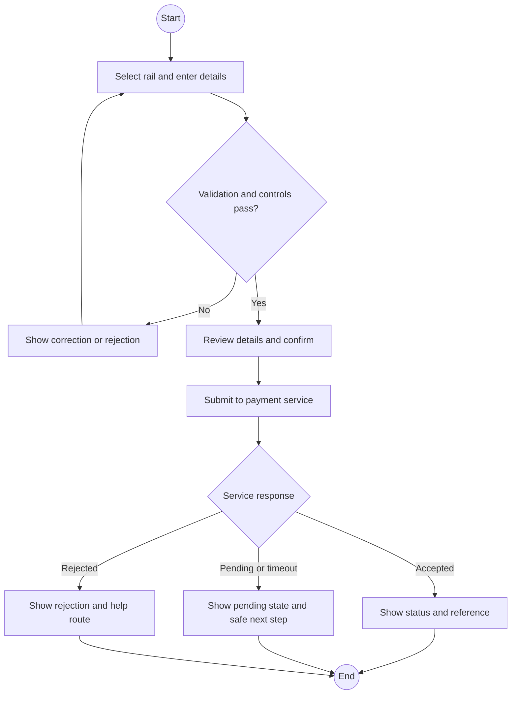

# Models, BPMN, and Miro Board Plan

All models below are analyst drafts derived from the short brief. Confirm role boundaries, systems, and policy with stakeholders before treating them as baseline.

## Context / system boundary

Candidate integrations are illustrative. The source does not name systems or establish that these interfaces exist.

## Use-case view

## Conceptual data model (draft)

The diagram conveys conceptual entities only; it is not a database design. Data ownership, joint access, retention, PII fields, cardinalities, and payment types require data-owner/security review.

## BPMN-style transfer process

This is BPMN-inspired Mermaid, not an exported BPMN 2.0 model. Formal BPMN should identify pools/lanes, message flows, events, gateways, exception boundaries, and system ownership in an appropriate modeling tool.

## Miro board layout

1. **Frame 1 — Charter:** problem, objectives, scope, constraints, open questions.
2. **Frame 2 — Stakeholders:** role map, power/interest, decision owners.
3. **Frame 3 — Research:** interview plan, evidence wall, validated facts vs assumptions.
4. **Frame 4 — Journey and As-Is:** one frame per transfer, utility payment, card payment; mark unknowns.
5. **Frame 5 — To-Be:** customer journey, backstage operations, systems, exception routes.
6. **Frame 6 — Requirements:** epics, story cards, business rules, priorities, trace links.
7. **Frame 7 — Risks and decisions:** payment controls, access, data, integration, release dependencies.
8. **Frame 8 — Validation:** review owners, UAT scenario links, decision/action register.

Use consistent sticky-note colors for source facts, analyst assumptions, validation questions, and approved decisions; include owner and date on each decision.
