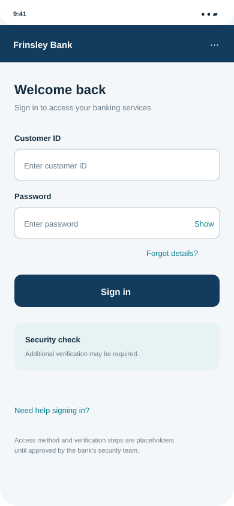
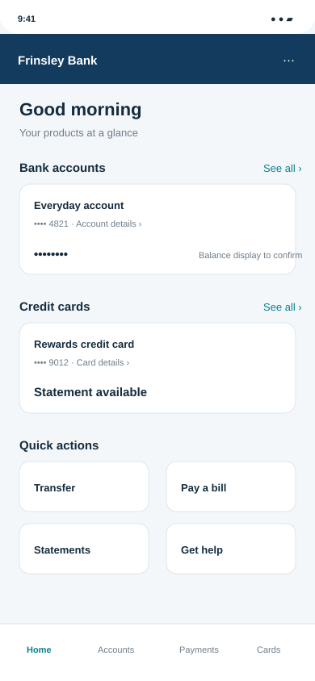
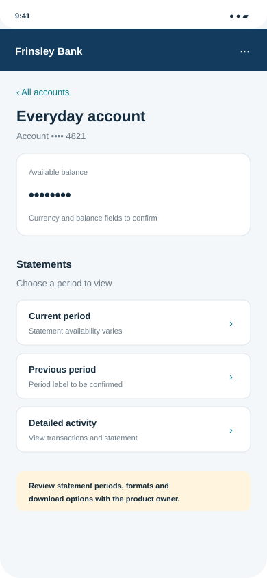
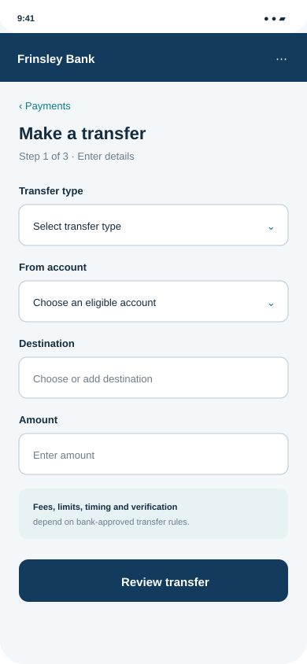
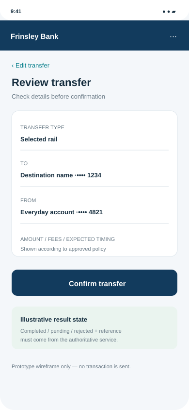
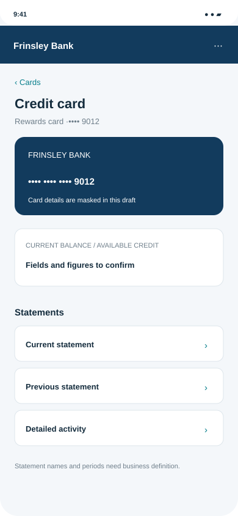
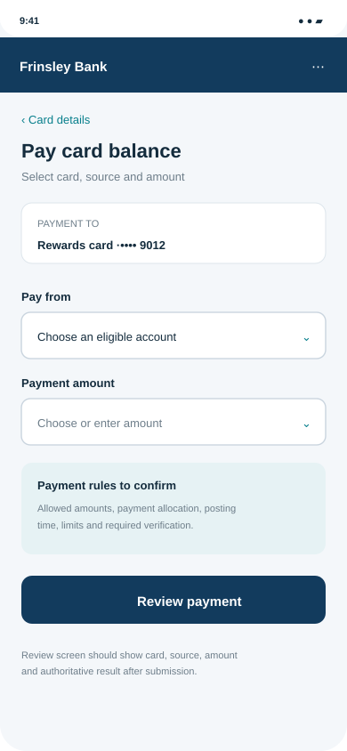
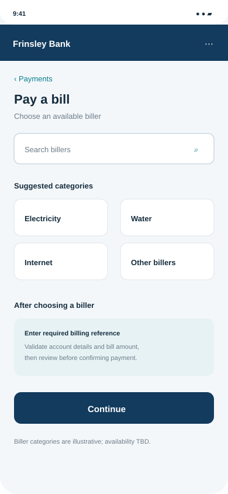

# Frinsley Bank — Mobile Wireframes

These eight low-fidelity screens and the click-through prototype are part of the complete [Frinsley Bank BA case study](../README.md). They use placeholder fields and labels; they do not represent approved branding, bank policy, or production behavior.

## Visual screen set

| Screen | Purpose | Preview |
|---|---|---|
| Sign-in | Secure entry and recovery |  |
| Unified overview | Accounts, cards, quick actions |  |
| Account and statements | Account details and statement periods |  |
| Transfer details | Rail, source, destination, amount |  |
| Transfer review and status | Review, confirm, and result state |  |
| Card and statements | Card information and statement choices |  |
| Card payment | Payment source, amount and review |  |
| Utility payment | Biller discovery and payment entry |  |

## Click-through prototype

[Open `prototype.html`](prototype.html) in a browser. It demonstrates navigation among the main screens and sample review/status states. It does not connect to a bank, authenticate users, or initiate transactions. For the project documents and all other BA artifacts, return to the [main README](../README.md).

## Review checklist

- Confirm navigation labels and account/card data fields with Product.
- Confirm statement terminology and available periods with Banking and Card Operations.
- Confirm transfer, bill payment, and card payment rules with Payments and Card Operations.
- Have Security, Risk/Compliance, Accessibility, and UX review the sensitive journeys.
- Replace placeholders only after relevant decisions are approved.
